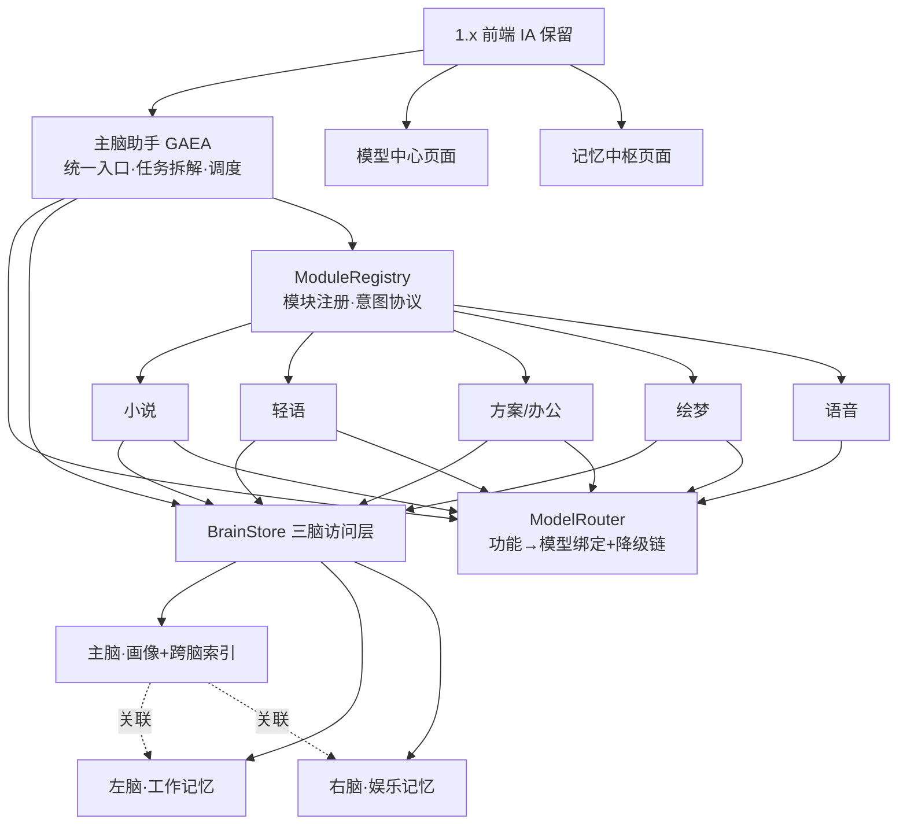

# gaea 2.0「三脑底座」设计（迭代式底层打通）

> 创建：2026-08-07 ｜ 基线：main `v1.21.0`（`9093930`，与 origin/main 一致）
> 状态：待评审 ｜ 定位：2.0 唯一设计入口
> 上一轮 2.0 因"重建代替迭代"已整体回退删除。本设计以 v1.21.0 为唯一主干，**逐层原地改造，1.x 功能全程可运行**。

## 1. 背景与教训（为什么这样规划）

上一轮 2.0 失败的五个结构性原因（审计与复盘结论）：

1. **定义错误**：把"重构"定义成"重建"——1.x 被定位为"行为参考，不是运行路径"，新代码从零写。
2. **计划无来源**：核心域实施计划全文没有引用任何 legacy 文件，没有移植任务。
3. **验收只认形状**：golden 冻结名字与数字，不验行为路径、事件序列、错误路径、绑定可用性。
4. **1.x 提前下线**：在行为对等之前 `git rm` 掉一代，失去"边跑边对"的参照物。
5. **记录失实**：进度文档把"域包里有工具"写成"应用里能用工具"，自评与事实脱节。

本设计的每一条约束都直接对抗这五个原因。

## 2. 目标与边界

### 2.1 目标（用户确认）

- 打通底层架构：模型中心让**每个功能模块绑定自己最合适的模型**（非全局单模型）。
- 记忆中枢实现**直接储存、共用和耦合**：模块记忆可分可合，跨模块可用。
- 各功能模块**相互独立、又相互关联**：独立=能力边界清晰；关联=经内核共享数据与模型服务。
- 为 3.0 的"单窗口自由调度各功能模块协作"奠定基础。

### 2.2 边界（2.0 不做）

- 不做数据迁移：现有 1.x 数据（轻语 hermes.db、小说项目、方案库、知识/成本/画像库）**零迁移**。
- 不重写模块：业务逻辑原地保留，只收敛模型调用与记忆读写。
- 不做 3.0 单窗口编排 UI：只预留模块注册表与意图协议接口。
- 不删除任何 1.x 功能：每一步都必须保持 1.x 能力可用。

## 3. 已确认决策

| 决策点 | 选择 | 说明 |
|--------|------|------|
| 2.0 首要目标 | B 底座打通 | 模型路由 + 三脑记忆 + 模块互联优先 |
| 迁移方式 | A 原地改造 1.x | 逐层在 1.x 上做手术，可运行、可验收、可回退 |
| 模型绑定 | 每功能绑定最合适模型 | 功能域各自绑定引擎/模型，显式降级链，禁止绕过 |
| 记忆架构 | 三脑 | 左脑=工作记忆；右脑=娱乐记忆；主脑=协调中枢 |
| 主脑形态 | B 主人格助手 | GAEA 统一入口：拆解任务→调两脑→派发模块 |
| 实施路线 | 路线 1 底座分层推进 | 模型→记忆→主脑→互联验收，每步独立提交 |

## 4. 总体架构



三层职责：

- **内核层（2.0 新增）**：`ModelRouter`、`BrainStore`、`ModuleRegistry`。三者只依赖 1.x 现有基础设施（配置/存储/事件），是 1.x 各模块的共同底座。
- **模块层（1.x 原样）**：小说、轻语、方案/办公、绘梦、语音。业务逻辑不动，仅把两件事收敛到内核：AI 调用一律走 `ModelRouter`；记忆读写经 `BrainStore` 适配器。
- **前端层（1.x 保留）**：页面与信息架构不动；新增主脑对话入口、模型中心"每功能绑定"管理、记忆中枢三脑视图。

## 5. 模型中心：ModelRouter（P1）

### 5.1 接口

```go
type ModelRouter interface {
    Bind(feature, engineID, model string) error     // 功能域绑定（持久化）
    Resolve(feature string) (engineID, model string) // 取生效绑定
    Fallbacks(feature string) []string               // 显式降级链
    Route(feature string) (engineID, model string)   // 含降级决策，可观测
}
```

### 5.2 功能域清单

`novel`（小说）｜ `whisper`（轻语）｜ `office`（方案）｜ `imagegen`（绘梦）｜ `voice`（语音）｜ `gaea`（主脑）｜ `memory`（记忆检索）。

### 5.3 规则

- 每个功能域独立绑定引擎 + 模型；全局活跃模型只是默认值，功能绑定优先。
- 降级链：**功能绑定 → 全局活跃 → 内置兜底**；每次 `Route` 的决策可观测（事件/日志）。
- **禁止绕过**：模块内不再允许直接硬编码模型名或直接调用引擎；所有 AI 调用经 `ModelRouter`。
- 绑定持久化沿用 1.x 配置机制（功能级模型绑定），扩展为完整路由表。

### 5.4 1.x 收敛点（改造位置）

对照 1.x 现有散落调用（E03/E09/E10 的修复文件）逐处收敛：方案 handler、轻语 chat、小说章节/分支/风格、绘梦、语音 LLM、办公 bridge、记忆检索。

### 5.5 验收

- "不绕过"行为测试：模块 A 绑定模型 X 后，调用 A 的任何 AI 功能都走 X（断言请求目标）。
- 降级链测试：功能绑定不可用 → 全局 → 兜底，决策可观测。
- E03 / E09 / E10 回归：功能级绑定不再被全局活跃引擎冲掉。

## 6. 三脑记忆：BrainStore（P2）

### 6.1 命名空间与职责

| 脑 | 命名空间 | 内容 | 现有存储（适配器接入，零迁移） |
|----|----------|------|-------------------------------|
| 主脑 | `brain.main` | 用户画像、全局事实、跨脑关联索引 | 画像库 |
| 左脑 | `brain.left` | 方案/项目/知识资产/成本/工程事实 | 方案库、知识库、成本库 |
| 右脑 | `brain.right` | 轻语人格/关系/情绪/情节、小说世界/角色/伏笔、生图偏好 | hermes.db、小说项目、绘梦偏好 |

语音与主脑不设独立的左右脑命名空间；如后续产生语音偏好等记忆，按阶段计划归入主脑画像或右脑。

### 6.2 接口

```go
type BrainStore interface {
    Read(ctx, namespace, entity string) ([]Fact, error)
    Write(ctx, namespace, entity, attribute, value string) error
    Search(ctx, query string, brains ...string) ([]Hit, error) // 跨脑检索
    Link(ctx, entity, brain, ref string) error                  // 主脑跨脑关联
    CrossRefs(ctx, entity string) ([]Ref, error)                // 实体 → 各脑引用
}
```

### 6.3 规则

- 现有各模块存储**原位不动**，通过适配器暴露给 `BrainStore`；不复制、不迁移数据。
- 跨脑耦合只走主脑索引：实体解析后返回各脑引用（如"甲方 A：右脑有聊天、左脑有标书"）。
- 模块仍可保留私有内部存储细节；对外只暴露三脑语义。

### 6.4 验收

- 跨模块检索：轻语写入"甲方 A 偏好保守报价"→ 方案模块写作时 `Search` 可命中并注入。
- 零迁移验证：1.x 现有数据原样可读，写入新事实不影响旧数据。

## 7. 主脑助手与模块协议（P3）

### 7.1 ModuleRegistry

- 模块注册：ID、名称、能力清单、支持的 intent 列表。
- 统一派发：`RunTask(module, intent, input)`（收敛 1.x 现有 office/general handler 雏形为协议）。
- 模块间**不直接调用**，只经主脑/内核协作；事件总线为模块协作通道。

### 7.2 GAEA 主脑

- 对话入口（前端新增主脑入口，1.x 页面保留）。
- 流程：意图识别（规则 + LLM）→ 取两脑资料（`BrainStore`）→ 派发模块（`ModuleRegistry`）→ 汇总回复。
- 1.x 办公 agent 能力保留：GAEA 从"办公专属"升级为"全模块协调者"。

### 7.3 验收

- 一句话任务派发到正确模块（如"帮我把这个标书写了"→ 方案模块）。
- 派发时自动注入相关脑资料（右脑甲方信息 → 左脑标书上下文）。

## 8. 前端范围

- 保留 1.x 全部页面与 IA。
- 新增：主脑对话入口（首页/顶栏）；模型中心"每功能绑定"管理页（强化 1.x FeatureModelBar）；记忆中枢三脑视图（主/左/右 + 跨脑关联展示）。
- **不做**：3.0 单窗口编排 UI（2.0 只留 `ModuleRegistry` 与意图协议接口）。

## 9. 兼容与版本

- 数据零迁移；配置沿用 1.x 机制扩展。
- 版本从 v1.21.0 连续演进（1.25 → 2.0.1），CHANGELOG 不断档。
- 每次合并必须 `go build/vet/test ./...`、`wails build`、前端构建全绿。

## 10. 测试与验收总则

1. **行为对等**：改动点同输入新旧对比，断言输出/事件/副作用一致（1.x 永远作为参照运行）。
2. **评估集回归**：E01–E24（1.x 真实修复样本）转自动化回归，作为"行为不倒退"闸门。
3. **记录属实**：进度只写已验证事实；未验证不写"完成"。
4. **2.0 完成判据**（可演示场景）：
   - 轻语里记住的甲方信息，方案模块写作时自动可用；
   - 小说/方案/轻语各自跑在绑定的模型上（配置可见、实际生效）；
   - 主脑一句话把任务派发到正确模块并汇总结果。

## 11. 实施顺序（每阶段独立提交 + 验收）

| 阶段 | 内容 | 验收 |
|------|------|------|
| P0 基线加固 | 构建/测试/回归自动化（E01–E24 转测试）、冒烟 | 全绿基线，可重复 |
| P1 模型路由 | ModelRouter + 模块调用收敛 + 绑定管理页 | 三模块绑定生效、不绕过测试、E03/E09/E10 回归 |
| P2 三脑记忆 | BrainStore + 主脑画像/跨脑索引 + 模块适配器 + 三脑视图 | 跨模块检索场景通过、零迁移验证 |
| P3 主脑助手 | ModuleRegistry + GAEA 调度 + 主脑入口 | 一句话派发 + 跨脑资料注入 |
| P4 互联验收 + 3.0 接口 | 完成判据演示；注册表/意图协议文档化 | 场景演示通过 |
| P5 发布 | 版本 2.0.1、CHANGELOG、releases、备份 | 发布全绿 |

## 12. 风险与红线

- **无 legacy 文件引用的任务不开工**（对抗"重建"）。
- 任何一步导致 1.x 功能不可用 → 回退该提交（1.x 全程可运行）。
- 模块绕过 ModelRouter 直接调用引擎 = 违规。
- 3.0 窗口 UI 不进 2.0（预留接口即可）。
- 记录只写已验证事实；失实记录按缺陷处理。

## 13. 后续流程

本设计评审通过后，按 `writing-plans` 为 P0→P5 各阶段产出实施计划；每个实施计划必须包含 legacy 文件引用清单与行为验收清单。
